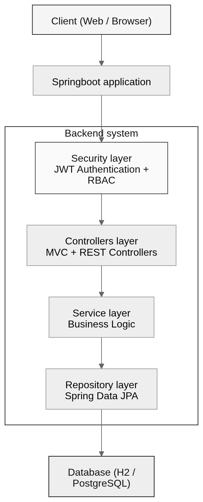

## IcesiFit - Physical activity system

A university-grade physical activity management system built for Universidad Icesi.
It centralizes training, routines, progress tracking, events, and notifications into a unified platform connecting students and certified trainers.

The system is built with a layered Spring Boot architecture, implementing JWT authentication, RBAC authorization, and JPA-based persistence.

> Frontend implementation is available [here](https://github.com/karoldmejia/icesifit-frontend)!

#### Problem context

Universidad Icesi required a centralized system to manage physical activity programs, including personalized training routines, progress tracking, trainer assignments, event scheduling, and real-time notifications. The goal was to unify these processes into a single scalable backend system.

#### System capabilities

* **User management:** Handles user registration, role assignment, and permission management across the system
* **Training system:** Supports creation and assignment of workout routines and exercises to users
* **Progress tracking:** Records and monitors user progress for exercises and training routines over time
* **Events & spaces:** Manages scheduling, availability, and organization of training events and spaces
* **Communication:** Sends notifications between users to support interaction and updates within the platform
* **Access control:** Enforces role-based permissions to restrict or allow actions across different system modules

#### Architecture & tech stack

| Layer        | Technology / Responsibility                     |
| ------------ | ----------------------------------------------- |
| Backend      | Spring Boot                                     |
| Architecture | Layered (Controllers → Services → Repositories) |
| Persistence  | Spring Data JPA                                 |
| Security     | Spring Security + JWT                           |
| Database     | H2 (dev) / PostgreSQL (production-ready)        |
| Frontend     | MVC + Thymeleaf templates                       |

  

#### Security model

| Component           | Purpose                                 |
| ------------------- | --------------------------------------- |
| JWT authentication  | Stateless session handling              |
| Password encryption | Secure credential storage               |
| RBAC                | Fine-grained access control per role    |
| Security filters    | Request-level authorization enforcement |

#### Testing & quality

Unit tests cover core service logic using JUnit.
Code coverage is tracked using JaCoCo reports to ensure reliability across business-critical modules.

#### Deployment

Deployed in a university environment and accessible via a local network instance. The system runs as a Spring Boot service exposing the full backend and MVC interface.